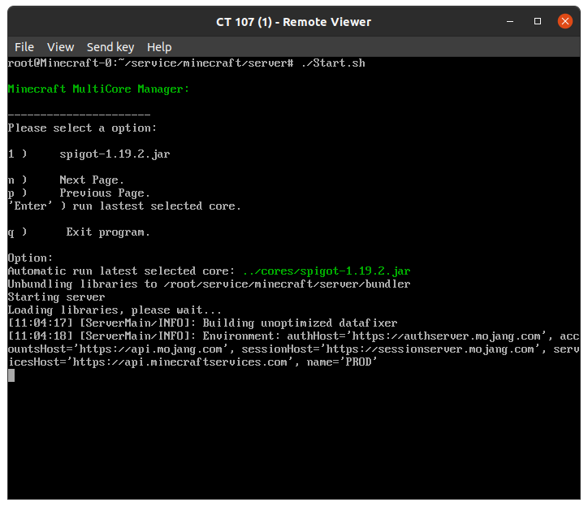

# Spitgot Server Manager ( aka Minecraft Server Manager )
## Introduction
Are you preparing to start a minecraft server? and you don't know how to management your files? 
it's a simple way to build and start the Minecraft server safely. Only need follow the user guide then you can start to play the game.

Note: it's just a simple bash script run at linux, won't have any protection mechanism inside.

# Features
 - Multiple core swicher
 - Quick start shortcut
   - Will automatic choose your last server option
 - Safe (without any backdoor)
   - Contain buildtool inside, let's you build the server by youself.
 - Small 
   - Only couple script inside

# TODO
 - Mutiple Server configration management
 - Port forwarding or Reverse Proxy
 - Plugin management
 - ... you decide ...

# Screenshot
- Server second with shortcut:
